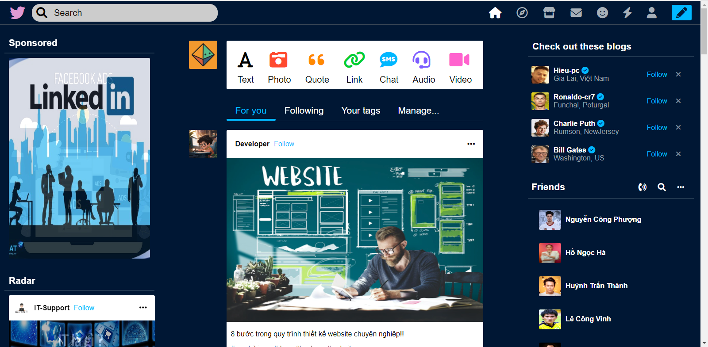

# Big.Project-TKWeb-IT21
# Trang Web Mạng Xã Hội 




## Giới thiệu

Trang Web Mạng Xã Hội là một ứng dụng web cho phép người dùng xem các bài viết qua internet. Ứng dụng được phát triển bằng HTML, CSS và JavaScript.

## Tính năng chính

- Hiển thị danh sách các bài viết trên mạng xã hội.
- Cho phép người dùng tìm kiếm các bài viết, chia sẽ khoảnh khắc cá nhân lên mạng xã hội.
- Theo dõi các tài khoản nổi tiếng trên thế giơi.
- Nhắn tin với bạn bè

## Cài đặt và Chạy
1. Clone repository:
  ```bash
git clone https://github.com/NguyenChinhNhan/Project-WebSocial.git
```
2.  Mở tệp `big-project.html` trong trình duyệt web để trải nghiệm trang web.


